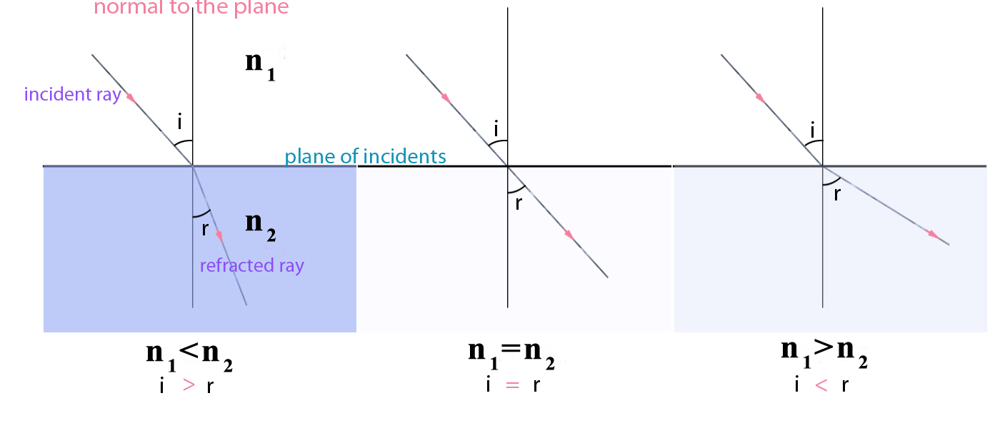
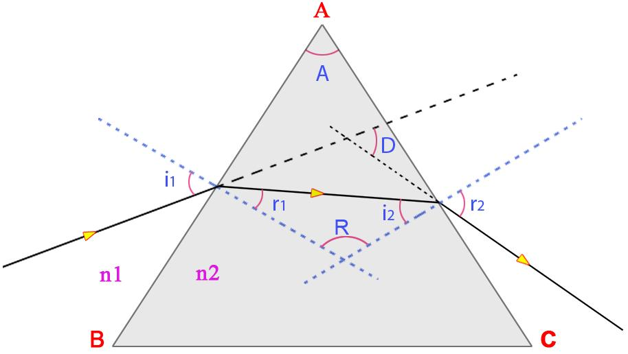

## Theory 

## Theory

When a beam of light strikes on the surface of transparent material(Glass, water, quartz crystal, etc.), the portion of the light is transmitted and other portion is reflected. The transmitted light ray has small deviation of the path from the incident angle. This is called refraction.

  
Willebrord Snel van Royen  (1580-1626)
 

 Refraction is due to the change in speed of light while passing through the medium. It is given by Snell's Law.

 $$\frac{\sin (i)}{\sin (r)}=\frac{n_{2}}{n_{1}}.............(1)$$

Where i s the angle of incident and r is the angle of refraction. And $n_{1}$ s the refractive index of the first face and $n_{2}$ is the refractive index of the second face.
 
And the speed of light on both face is related to the equation

$$\frac{c_{1}}{c_{2}}=\frac{n_{2}}{n_{1}}..................(2)$$

$c_{1}$ is the velocity of wave in first face and $c_{2}$ is the velocity of wave in second face .

Figure 1: The changes in refracted angle with respect to the refractive index . 

Consider a prism  of angle A and refractive index n2. Let i1 and r1 are the incident and refracted ray from face AB, and i2 and r2 are the incident and emerged ray from the second face AC.

  

 

### Dispersive power of prism
The refractive index of the material of the prism can be calculated by the equation.

 $$n=\frac{\sin \left( \frac{A+D}{2} \right)}{\sin \left( \frac{A}{2} \right)}...............(3)$$

Where, D is the angle of minimum deviation, here D is different for different colour. 
Consider two colour green and violet, corresponding minimum deviation is $D_{G}$ and $D_{V}$ ,corresponding  refractive index is.

$$n_{G}=\frac{\sin \left( \frac{A+D_{G}}{2} \right)}{\sin \left( \frac{A}{2} \right)}\text{,   }n_{V}=\frac{\sin \left( \frac{A+D_{V}}{2} \right)}{\sin \left( \frac{A}{2} \right)}....(4)$$

There for dispersive power is.

$$\omega=\frac{(n_{V}-n_{G})}{n}............(5)$$

Where 

$$n=\frac{(n_{V}+n_{G})}{2}............(6)$$

